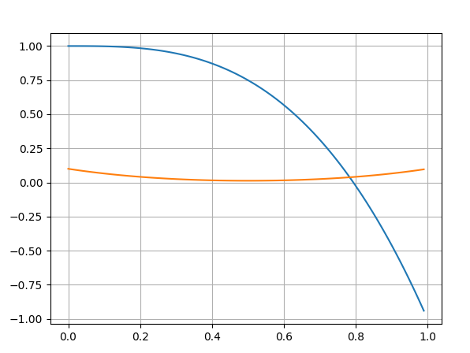
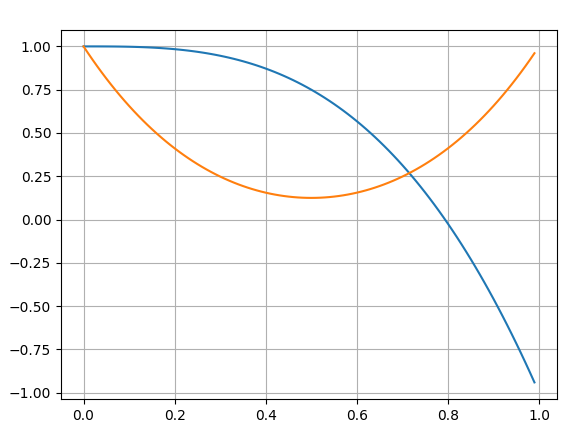
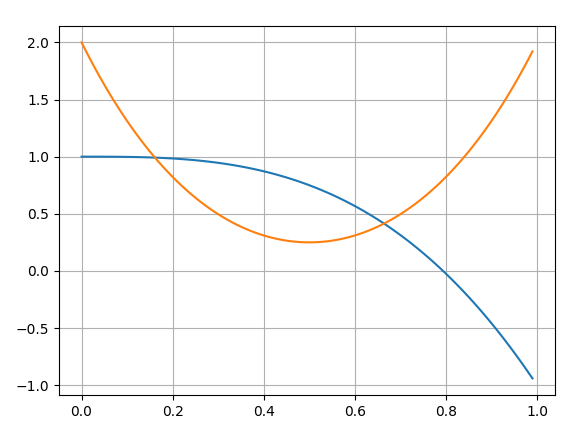

# Taskmaster Series 20 Episode 5 - Studio task

Eat the Lamé duck, or don't eat the Lamé duck (made out of vegan chocolate).

- If 1 person eats the duck and the other 4 do not, the duck eater gets 5 points added to their series points total, and everyone else loses 1 point.
- If >1 person eats the duck, the duck eaters lose 3 points and everyone else gains 3 points.
- If everyone eats the duck, then everyone gets given £25.
- If no one eats the duck, then everyone must give Greg £25.

Determining the optimum strategy in this task is challenging. To come up with an answer it is necessary to make at
 least some assumptions. The key questions are: How do the players value points vs cash? And how should the players value points being added 
 to the series total of the *other* players?

Here, we analyse the game under a variety of different assumptions, starting with the simplest case, and then making things progressively
more complicated.

## If someone cares only about money, not points

If someone cares only about money, not points, then it is easy to figure out *their* optimum strategy: *they should eat the duck.*
This is because, if you only care about money, then choosing to eat the duck will sometimes make your situation
better, and it will never make it worse:

- If the other 4 players eat their ducks, then if you eat your duck as well you will gain £25.
- If the other 4 players are not eating their duck, then if you eat your duck you will avoid losing £25.
- In all other situations, eating or not eating the duck will make no difference to how much cash you have.

## If *everyone* cares only about points, not money

Next, we will consider the case in which *every* player cares only about points, not money. In addition, we will also assume
that every player knows that every other player only cares about points. This is common knowledge.

In this situation, there is no longer one choice that is clearly best for these players. Why? Well, it can't be best for everyone to not eat
their duck, because if everyone else is not eating their duck, then you can gain an advantage by eating yours
(you gain 5 points and they all lose 1). But conversely, if everyone else is eating their duck, then you can gain an advantage by *not* eating yours 
(you gain 3 points and they all lose 3).

Interestingly, the two scenarios just described are both equally valuable. This is because players should not care if everyone gains or loses
exactly the same number of points, since they are only competing against each other (Sanjeev makes this point on the show).
And in both situations, you gain the same relative advantage of 6 points over your opponents. This is all that matters.
Alex Horne has chosen different numbers only to make the task sound more confusing than it already was, in characteristic fashion.

But the symmetry between eating and not eating the duck is broken by the situations in which we have a 2 vs 3 split. In these situations,
not eating the duck is always the better strategy (all non-eaters gain a relative advantage of 6 over all eaters). So in at least some sense,
not eating the duck seems a *better* choice than eating the duck. It wins in more situations than it loses. 
But we can't say that everyone should predictably not eat their duck, or they could be exploited by someone who deviates and eats theirs.
So what should a rational player do?

### Nash equilibrium

We are playing a game where our best move depends on what the other players do, and they make their decision in secret. In games like this, you can't find the optimum strategy with maths alone. That's because the optimum strategy is to accurately predict what the other players are going to do, and respond accordingly, and that is a problem of psychology, not mathematics.

However, using Game Theory, you can calculate something called the Nash equilibrium strategy. This is a strategy with the following property:

*If all players are following the Nash equilibrium strategy, then no individual player can benefit by deviating from the Nash equilibrium strategy.*

In this sense, the Nash equilibrium strategy represents a kind of stable situation. In an interesting game, the Nash equilibrium strategy will involve selecting from a few options at random, according to particular probabilities. For example, in Rock/Paper/Scissors, the Nash equilibrium strategy is to select between Rock, Paper, or Scissors, with 1/3 probability each. This still isn't so interesting, because all moves are equally good. But in more complicated games, like this one, the Nash strategy will have you selecting between the different moves with different probabilities.
We can now make precise the sense in which not eating the duck is better than eating it: it will be assigned a higher probability in the Nash equilibrium strategy.

If you had a perfectly rational self-interested player, who knew for certain that all of the other players were also perfectly rational and self-interested, then you might expect this player to adopt the Nash equilibrium strategy when playing the game. Why is this? Well no other strategy would make sense for them. If you were to propose that a rational self-interested player should instead pursue strategy X, then they should expect that all the other players will play X as well, since we are assuming they are all reasoning similarly. But if all the other players are playing X, and X is not a Nash equilibrium strategy, then X is not the best strategy to pick in response, and we have a contradiction.

But it is important to stress that this does not mean a player following the Nash equilibrium strategy will always come out on top against players who are following a different strategy. For example, in Rock/Paper/Scissors, if a player follows the Nash equilibrium strategy of randomly picking between the moves with 1/3 probability each, then their chance of eventual victory (and their opponent's) will always be 50/50. This is true whatever their opponent is doing. They have no advantage over any opponent.

So what is the Nash equilibrium strategy in this game, when all players care only about points?

### How to value the mixed case

Before we can calculate the Nash equilibrium strategy, we first need to decide how to value the situations with a 2 vs 3 split.

If you are the only player who does not eat your duck, then you gain a relative advantage of 6 points over all of your opponents.
And to make things easy for us, this relative advantage is exactly the same as the opposite case where you are the only player who *does* eat your duck.
But what if two people do not eat their duck (as happened on the show)? Now, you gain an advantage of 6 points over 3 of your opponents,
but your situation relative to your 4th opponent is left unchanged. How should you value this, relative to the first case?

It is difficult to give a definitive answer to this question. Lets suppose that what each player cares about is their probability
of eventually becoming series champion (already you could question this assumption: maybe a player actually cares more about not coming last!)
We then need to calculate the effect of a given distribution of points among the players on each player's probability of series victory.
But this is going to be very complicated to work out in general.
It would require us to look at each player's current series scores, and also to assign a probability distribution for how many points we expect
each of them to go on to achieve during the remainder of the series.

This will get messy, so we won't do that. Instead, to proceed, we are going to have to make some more simplifying assumptions:

- We assume that all points changes during this task are *small* relative to the overall series scores. This is a reasonable assumption.
- We assume that the points changes relative to each opponent are valued in exactly the same way. This is a less realistic assumption, since 
presumably we expect that some opponents are more likely to go on to win the series than others. If we are trying to maximize our probability of
winning the series, then we should care more about our points advantage over them than over someone who is likely to come last anyway. But we're
going to ignore this here and treat all opponents on the same footing.

Using the first assumption, we can expect the change in probability of series victory to be given by:

$\Delta P = \sum{c_{i} v_{i}} + O(v_{i}^{2})$

where $v_{i}$ is the relative points advantage over the ith player, and the $c_i$ are some set of constants
(the partial derivatives of $P$).

The second assumption now allows us to conclude that all of the $c_{i}$ are equal, so there is only a single constant undetermined.
And this single constant is irrelevant for determining the strategy with highest expected value, so we now have all we need.
The value of an outcome is proportional to the sum of the relative points advantage over each opponent.

We will pick the constant so that we assign value using the *average* points advantage. So we will say that the situation where you gain 5 and
everyone else loses 1 has value 6. A situation where you and another gain 3, and everyone else loses 3, has value:

$\frac{1}{4}\left(0+6+6+6\right) = \frac{9}{2}$

### Computing the Nash equilibrium strategy

We are now ready to compute the Nash equilibrium strategy in the situation where every player cares only about points, not at all
about cash (and where every player knows that every other player feels this way).

Suppose that in Nash equilibrium, the probability of any player choosing to *not* eat the duck is $p$. Now take the perspective of one
of the players. If this is a Nash equilibrium, there must be no incentive for this player to deviate from the Nash equilibrium strategy.
And for this to be the case, the expected value of eating the duck must be the same as the expected value of not eating the duck. This constraint
gives us a polynomial equation in $p$ which we will be able to solve.

$E(\text{eating duck}) = (6) p^{4} + {{4}\choose{1}}(\frac{-3.6}{4}) p^3 (1-p) + {{4}\choose{2}} (\frac{-2.6}{4}) p^2 (1-p)^2 + {{4}\choose{3}} (\frac{-6}{4}) p (1-p)^3 + (0) (1-p)^4$

$E(\text{not eating duck}) = (0) p^{4} + {{4}\choose{1}} (\frac{-6}{4}) p^3 (1-p) + {{4}\choose{2}} (\frac{2.6}{4}) p^2 (1-p)^2 + {{4}\choose{3}} (\frac{3.6}{4}) p (1 - p)^3 + (6) (1-p)^4$

Imposing that these are equal gives us:

$6 (1-p)^4 + 6 {{4}\choose{1}} p (1-p)^3 + 6 {{4}\choose{2}} p^2 (1-p)^2 + \frac{2.6}{4} {{4}\choose{3}} p^3 (1-p) - 6 p^4 = 0$

And this simplifies quite nicely to:

$6 \left((p + (1-p))^4 - \frac{1}{2} {{4}\choose{3}} p^3 (1-p) - 2 p^4 \right) = 0$

$1 - 2 p^3 (1-p) -2 p^4 = 0$

$p = \left(\frac{1}{2}\right)^{\frac{1}{3}} \approx 0.79$

So in Nash equilibrium, each player should randomly choose not to eat their duck 79% of the time, and choose to eat their duck 21% of the time.

This result aligns with our previous intuition that not eating the duck is a better option than eating it (even though you should 
still eat it sometimes). It also means that we should expect about 1 of the 5 players to eat their duck in a typical game. This makes sense. If we were very
confident that more than 1 player would eat their duck, then not eating the duck would become the best strategy. And if we were very confident
that none of our opponents were going to eat their duck, then eating the duck would become our best strategy. It makes sense that the Nash equilibrium
lies somewhere between these extremes.

### The value of the game

How much of a points advantage should each player expect to get, on average, in this equilibrium situation? Well, it had better be zero! This is 
because the expected value of the game is the same for each player, and if the players only care about their points total relative to the other players,
then the game is zero-sum (one player's advantage always comes at the other players' expense).

You can verify that substituting $p = \left(\frac{1}{2}\right)^{\frac{1}{3}}$ back into the two expected value expressions for the two strategies does indeed
give zero as expected.

This will change when we consider players who value money as well as points. Then the game is no longer zero-sum (it is possible for the players 
to collectively gain or lose money, while staying level on points).

## If *everyone* has the same conversion factor between points and money

Next, we will consider the situation where players care about both money *and* points, but each player assigns exactly the *same* relative value
to money and points (and as usual, every player is aware that this is true of every other player).

Lets suppose that each player would be willing to lose $v$ points relative to all of the other players, in exchange for £25. This now sets the value
for the situation where everyone eats the duck (each player values this as $v$) and where everyone does not eat the duck (each player values this as $-v$),
since in each of these situations the relative points differences among the players are unchanged, but they all receive (or all lose) £25.

We can now try to find the Nash equilibrium again for this new game. We can apply the same method as the previous section. We assume that each player
chooses not to eat the duck with probability $p$, and this value of $p$ is chosen so that no player has an incentive to deviate from this strategy.

In the previous section, we only needed to consider values of $p$ which were strictly greater than 0 and less than 1, since it was clear that the situations
where everyone eats or does not eat the duck were not stable. For this to be an equilibrium,
it then had to be the case that both moves were equally valuable for each player (otherwise players could benefit by shifting the probability towards
the more valuable move). But now, we need to consider the $p = 0$ case more carefully as well. It is possible for $p = 0$ to be an equilibrium if
eating the duck is *more* valuable than not eating the duck for each player. And this will clearly be the case when $v \geq 6$. If each player values £25
at least as much as they value a 6 points advantage relative to all other players, then the situation where everyone eats the duck and everyone receives
£25 will also be a Nash equilibrium, where no one has any incentive to deviate.

What about $0 < v < 6$? We can analyse this in the same way we did in the previous section. The only change is that the polynomial expressions for the
expected values now have shifted coefficients on the terms that correspond to everyone eating or not eating their duck.

If you follow the algebra through, you will find the following modified equation for $p$ in Nash equilibrium:

$1 - 2 p^3 = \frac{v}{6} \left(p^4 + (1-p)^4\right)$

In order for both moves to be equally valuable to all players, $p$ must solve this equation.

It is harder to write down a closed form anwer to this equation, but we can sketch some plots to understand what the solutions will look like
for different values of $v$. We plot the LHS in blue and the RHS in orange.

When $v$ is small, we only get a minor change to the result of the previous section. Nash equilibrium will occur when $p$ is slightly less than
0.79:

As $v$ increases, we continue to get a unique solution for $p$ that decreases as $v$ increases, but stays larger than $1/2$, until $v$
reaches the critical value of 6. It is easy to see by inspecting the equation that this is the critical value where the two curves intersect
at $p = 0$ as well.

The $p = 0$ solution is the Nash equilibrium we had already found above, which we know continues to exist for all $v \geq 6$. But now we can see
there is actually still a second Nash equilibrium as well, with $1/2 < p < (1/2)^{1/3}$.

What does this mean? We brushed over this before, but it is not always true that a game has a unique Nash equilibrium. In such situations, it is not
necessarily easy to say which Nash equilibrium strategy a rational player should follow. In this case though, the $p = 0$ strategy is strictly
better for every player, so it seems reasonable to assume that they will follow that one! Why is it strictly better? Well, their expected points advantage
under any strategy must be zero, by symmetry, and by the fact that points advantage is zero-sum. This means that 
to find the value of the game, we just need to look at the expected value of the cash they receive. They are guaranteed to gain £25 under the $p = 0$
equilibrium, while their expected cash is *negative* under the $p > 1/2$ strategy, since it is more likely that everyone will not eat the duck than
that everyone will eat it.

There are actually even more Nash equilibria in this game, even in the simpler $v = 0$ case, that we have sneakily brushed under the carpet so far.
We did this when we made the assumption that every player will follow the same strategy (which we justified by symmetry). But technically,
we could have imagined a scenario where the first player eats the duck with certainty, and every other player does not eat it with certainty.
This is also a Nash equilibrium! No player is better off if they change their strategy! But we will continue to ignore these equilibria as well,
until we tackle the situation where different players have different values, in which case we will be forced to consider that they might
each follow different strategies.

What happens when $v > 6$? We already know that we have a Nash equilibrium at $p = 0$, and that this will give the best results for each player,
so that's the strategy we should expect them to follow. But it is interesting that we continue to have solutions to the above equation as well!
There are now two $p > 0$ solutions, meaning that we have 3 symmetrical Nash equilibria in total!

We can see that this situation will continue as $v$ increases, until these two additional equilibria eventually collide with each other close to $p = 1/2$.
After this, there will be no more solutions to the equation, and $p = 0$ will be the unique (symmetrical) equilibrium again.

### Summary

It is worth stepping back and summarising the optimum strategy for the case where everyone has the same conversion factor, $v$, between £25 and points.

When $0 \leq v < 6$, players should choose to not eat the duck with some probability $p$ that is strictly greater than $\frac{1}{2}$.

When $v \geq 6$, there is a sudden transition in optimum strategy. Players should now *always* eat the duck. Their relative points are unchanged,
and they each receive £25. None of them have any incentive to deviate, since they value £25 more than a 6 points relative advantage.

### The value of the game

When $v \geq 6$ and $p = 0$, the value of the game is simply £25 for each player.

Bur when $0 < v < 6$, the value of the game is now *negative* for each player.
This is because they should each expect a 0 change in relative points advantage, by symmetry, but there is more chance that they will all lose
£25 than that they will all win £25, since $p > \frac{1}{2}$. Unlike the previous section, the players now care about cash, so this situation
is bad for them!

This is interesting. If these players could just all agree to eat the duck, then they could each reveive £25. But instead, we are claiming they will follow
a strategy that will *lose* them money in expectation. So how can we call this strategy the 'optimum' strategy?

It is worth remembering why eating the duck cannot be the optimum strategy under our approach. The problem is that if you know everyone else is eating
their duck, then you can make yourself better off by not eating yours (since you value a 6 points advantage more than £25).

This is an example of a "prisoner's dilemma", a classic problem in game theory. If each player pursues their self-interest, then this leaves each of them
worse off than if they had been able to agree to cooperate. Philosopher Derek Parfit would say that self-interest is "collectively directly self-defeating".
 Cite. Some people have argued that faced with such situations, a truly rational agent should cooperate.. Cite.. But here we will take the conventional
 approach.

**Spoiler alert:** This dynamic is exactly what played out on the actual show! They quickly realised that if they could all agree to eat the duck, then there would be no change
in their points relative to each other, and they could each be £25 richer. However, although each of them seemed to be agreeing to follow this approach,
Reece "defected" by not eating his, as did Phil. This meant they received 3 points each and everyone else lost 3.

## If each player has a different conversion factor between points and money, but the conversion factors are common knowledge

What if the different players value money differently?

As soon as we allow different conversion factors for the different players, the game becomes far more complex. We have so far restricted to considering only symmetric equilibria (where each player follows an identical strategy), and with this restriction, it has always been possible to figure out which equilibrium solution the players should adopt. But now, the players' payoffs are no longer identical, so their strategies should not be either. We are forced to consider all the Nash equilibria which exist in the game, including strange ones (e.g. one player always eats the duck and the others all do not eat it). It will become harder to say which of the many possible Nash equilibria a rational player should follow.

There are still some boring situations. First, if $v \geq 6$ for every player, then it makes no difference if their values are not identical. Each player should eat their duck. It is clear that this is a Nash equilibrium. No one can benefit by changing their strategy, since they each value £25 more than they value a 6 points advantage over all the other players. And it is also the "best" equilibrium, since each player gets the maximum possible payoff. The more interesting situations are therefore those in which at least one player has $0 \leq v < 6$.

The script equilibrium_calc.py finds all of the Nash equilibria for an arbitrary set of conversion factors, $v_i$. This logic has been rewritten in javascript, and provides the strategies for the browser based game contained in this repo (to follow!) Here, we discuss some interesting special cases.

### If one player cares slightly about money, but the rest care only about points

Suppose that the first 4 players have $v = 0$ but the 5th player is willing to trade points for money as long as the price is high enough (lets say $v = 1$ so that they are willing to give up a single point if paid £25). We already saw that if all players have $v = 0$, then there is a Nash equilibrium where every player eats the duck with probability $0.21$. What happens to this equilibirum if the 6th player's values change to $v=1$ while the rest remain unchanged?

Naively, we might expect the 5th player to adopt a higher probability of eating their duck, since they are now more interested in achieving the £25 payoff (which occurs if everyone eats their duck) and avoiding the £25 loss (which occurs if everyone does not). But surprisingly, the result is actually the exact opposite! If $v_i=0$ for the first 4 players and $v_5=1$, then the this equilibrium shifts so that the first 4 players eat their duck with probability $0.22$ (slightly higher) and the 5th player eats their duck with reduced probability $0.16$.

Why is it this way round? Well, consider the perspective of the 5th player. We need eating the duck and not eating the duck to be equally valuable moves for them. The fact they now value money as well as points means that eating the duck has become more valuable than it was before. In order to bring the value of the two moves in line again, the other 4 players must *increase* the probability that they eat their duck, which makes this move less attractive for the 5th player. From the perspective of the other players, for their moves to still be equally valuable, the 5th player's probability of eating their duck must *decrease*.

Of course, there are plenty of other Nash equilibria as well (31 in total) but this particular one is interesting because it comes from the equilibrium solution that we discussed above. It is also symmetric among the 4 players with the same values (whereas most of the others are not).

The value of the game is very slightly negative for the 4 $v = 0$ players (-0.006), implying that they will lose points, on average, to the 5th player. And it is also significantly negative (-0.28) for the 5th player, since there is a significant risk that everyone will lose £25 (which outweighs their slight gain in points).

This is interesting! Making one of the players care slightly less about points vs money has, counter-intuitively, meant that that player now ends up with more points!

### If only one player has $v < 6$ and the rest care only about money (almost)

If a player cares *only* about money, then we already figured out how they should play the game. They should always eat the duck, since this sometimes improves their situation and never makes it worse. So if a single player who values points is faced with 4 opponents who all *only* care about money, their strategy is then straightforward: they should not eat their duck, while the other players all eat theirs.

But what about if the other players care about points just a little bit? Maybe they have something like $v = 100$. There are only two Nash equilibria which involve identical strategies for each of the $v = 100$ players. One is the boring one, where they all never eat the duck and the first player always does. But the other is a strategy where the first player eats the duck with probability $0.93$ and the four money-valuing players eat the duck with probability only $0.21$.

This is again pretty odd! It is again the player who cares more about points who will eat their duck more often!

In the limit $v \rightarrow \infty$, duck-eating probability of first player approaches 1, while probabilities of the other 4 stay at $0.21$.... TODO: explanation

### If the $v_i$ are spread evenly throughout the range [0, 6)